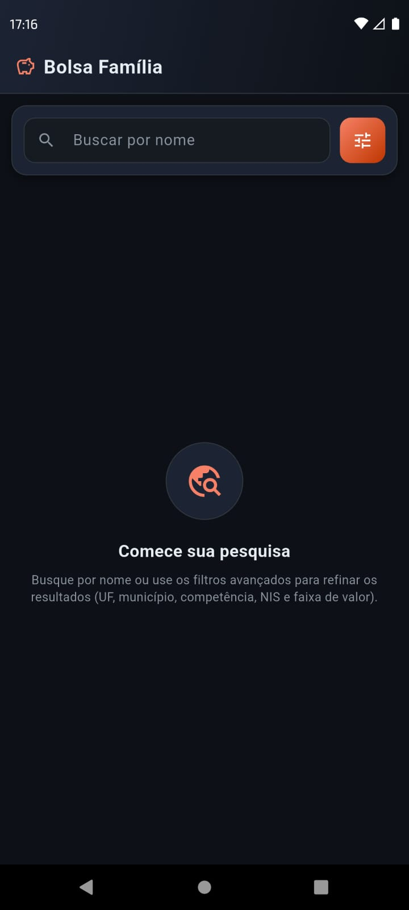
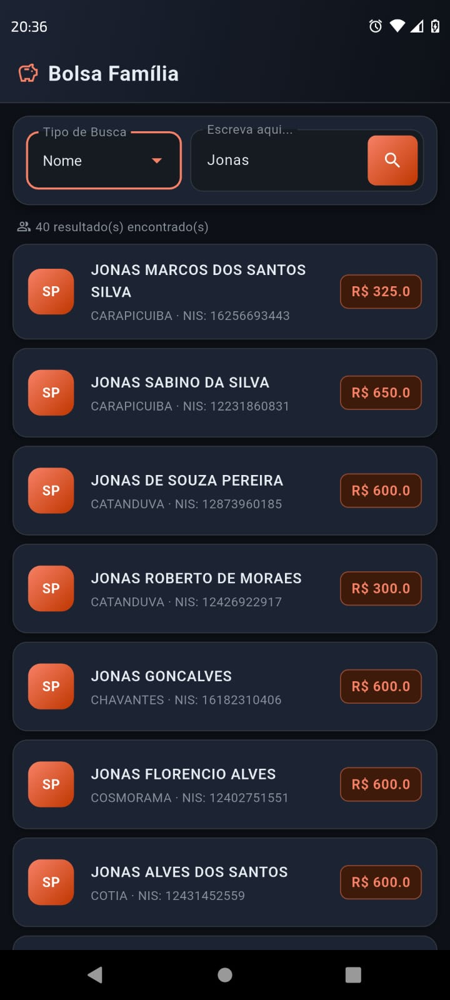

<div align="center">

# Bolsa Família — API + App

Consulta de beneficiários do programa Bolsa Família: API REST em **Java / Spring Boot** e app Android em **Flutter**.


</div>

---

## Sobre

Aplicação full-stack (trabalho acadêmico de ADS) para buscar beneficiários em uma base pública. O app Flutter consome a API Spring Boot, que consulta o PostgreSQL com filtros dinâmicos e paginação.

| Pasta | Papel |
|-------|--------|
| `bolsafamilia/` | API REST (Spring Boot + JPA + PostgreSQL) |
| `bolsafamilia_app/` | App Flutter com tema dark, busca e filtros |
| `HelpForUs/` | Documentação didática do código |

---

## Demonstração

<div align="center">

| Tela inicial | Resultados da busca |
|:---:|:---:|
|  |  |

</div>

- **Tela inicial:** estado vazio com busca por nome e acesso aos filtros avançados.
- **Resultados:** lista de beneficiários (UF, município, NIS e valor da parcela), com paginação infinita.

---

## Funcionalidades

- Busca por nome, UF, município, competência, NIS e faixa de valor
- Filtros combináveis (API via JPA Specification)
- Paginação no back-end e scroll infinito no app
- Interface dark com chips de filtros ativos

---

## Como executar

### 1. API

Configure o banco em `bolsafamilia/src/main/resources/application-local.properties` e suba:

```bash
cd bolsafamilia
./mvnw spring-boot:run
```

API em `http://localhost:8080` — endpoint principal: `GET /api/Bolsafamiliamodel/busca`.

### 2. App

No arquivo `.env` do Flutter, use o IP da máquina (não `localhost` no Android):

```env
_url=http://192.168.x.x:8080/api/Bolsafamiliamodel/busca
```

```bash
cd bolsafamilia_app
flutter pub get
flutter run
```

---

## Estrutura

```text
BolsaFamilia.app/
├── bolsafamilia/          # API Java
├── bolsafamilia_app/      # App Flutter
├── HelpForUs/             # Explicações do código
├── img/                   # Capturas de tela
└── README.md
```

Mais detalhes da API e do app estão em [`HelpForUs/`](HelpForUs/).

---

## Autores

Trabalho de final de semestre — **Análise e Desenvolvimento de Sistemas (ADS)**.

> @AndreMch2001
